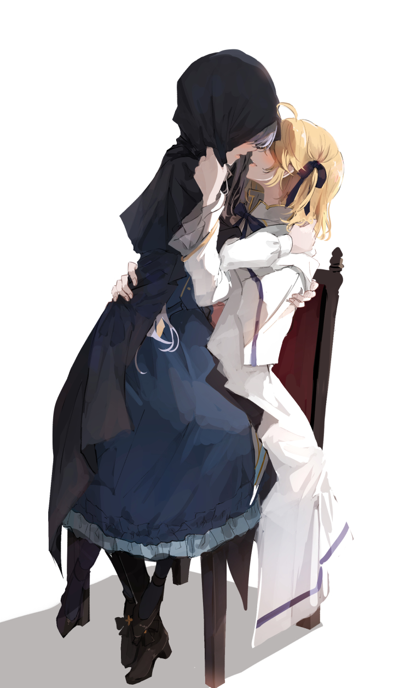

# Ciallo～(∠・ω< )⌒★

- I'm NephrenCake. 你可以叫我浅幽。请随意~
- I'm a CS master candidate in the [**Department of Computer Science and Engineering**](https://www.cs.sjtu.edu.cn/index.aspx) of the [**Shanghai Jiao Tong University**](https://www.sjtu.edu.cn/).
- I'm currently learning [**Kubernetes**](https://github.com/kubernetes/kubernetes).
- Striving to write the most graceful code.

<!--

  <strong><a href="">Official Website</a></strong> |
  <strong><a href="">Twitter</a></strong> |
  <strong><a href="">Discord</a></strong> |
  <strong><a href="">LinkedIn</a></strong> |
  <strong><a href="">Twitch</a></strong>

-->

<!--
**NephrenCake/NephrenCake** is a ✨ _special_ ✨ repository because its `README.md` (this file) appears on your GitHub profile.
Here are some ideas to get you started:
- 🔭 I’m currently working on ...
- 🌱 I’m currently learning ...
- 👯 I’m looking to collaborate on ...
- 🤔 I’m looking for help with ...
- 💬 Ask me about ...
- 📫 How to reach me: ...
- 😄 Pronouns: ...
- ⚡ Fun fact: ...
-->
